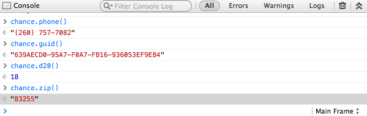

# 

**Chance** is a minimalist generator of random <a href="#true-random">[1]</a>
strings, numbers, etc. to help reduce some monotony particularly while writing
automated tests or anywhere else you need anything random.

**Chance** is open source software and is released under the developer and
business-friendly [MIT License](http://en.wikipedia.org/wiki/MIT_License)

**Chance** is loaded on this site so you can just open the console on your
browser and play!

<a class="twitter-share-button"
    href="https://twitter.com/share"
    data-size="large"
    data-text="Chance - Utility library to generate random things for JavaScript"
    data-hashtags="chancejs,javascript"
    data-url="http://chancejs.com/"
    data-count="horizontal"
    data-via="victorquinn">
    Tweet
</a>

Written by [Victor Quinn](https://www.victorquinn.com)

## Download Chance

<ul class=downloads>
    <li>
      <a href="chance.js" class="download" download="chance.js">chance.js v{{ page.version }} (for development)</a>
      - <i>95KB uncompressed</i>
    </li>
    <li>
      <a href="chance.min.js" class="download">chance.min.js v{{ page.version }} (for production)</a>
      – <i>55KB, 17KB when gzipped</i>
    </li>
  </ul>

